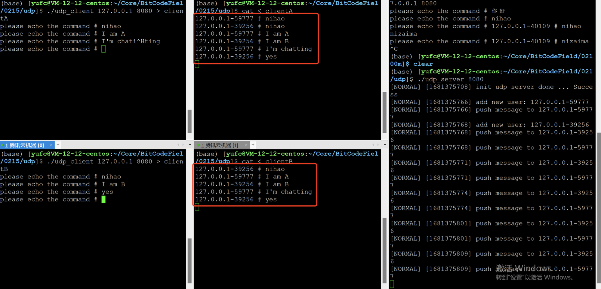
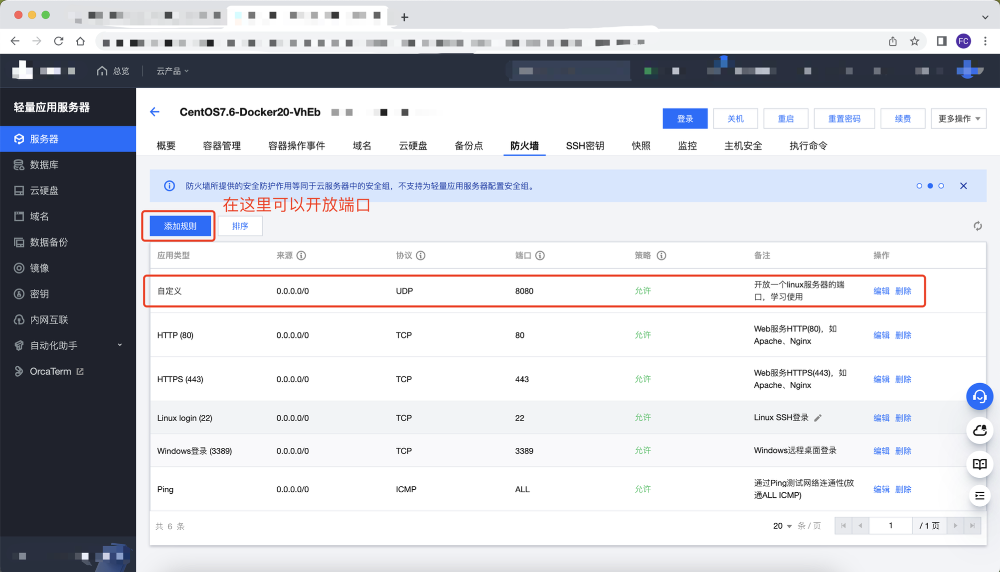
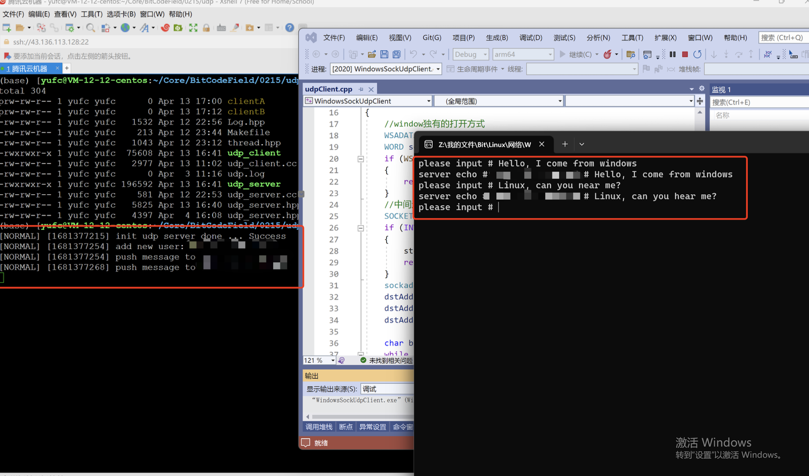

### Udp套接字编程｜实现群聊通信｜实现Windows & Linux通信交互

**本项目通过Linux套接字编程，实现Udp通信**

本项目只实现通信的核心框架代码。

可以实现的交互功能有：

- Linux主机上本机不同进程的本地环回信息交互，效果如图1所示。

- Linux主机上实现不同进程之间“群聊”效果，效果如图2所示

- 不同Linux主机上的Udp通信。

- Windows客户端与Linux服务端进行信息交互，通过对核心的代码改进，还可以实现不同Window客户端之间通过Linux服务端进行信息交互，效果如图4所示。

#### Linux主机本地环回

首先在客户端向服务端传送message，服务端把message原封不动地发回给客户端。如果读者希望服务端对message进行进一步变换，可以直接对代码逻辑进行改进。

**图1**

**运行方法：**

`make clean; make` 生成可执行

`./udp_server 8080` 服务端开机，设置端口号为8080

`./udp_client 127.0.0.1 8080` 客户端开机，127.0.0.1代表本地环回，设置端口号为8080。

#### Linux主机实现不同进程的“群聊”效果

**图2**

**运行方法：**

`make clean; make` 生成可执行

**服务端SSH：**

`./udp_server 8080` 服务端开机，设置端口号

**客户端A输入SSH：**

`mkfifo clientA` 生成管道文件，用于信息的收取

`./udp_client 127.0.0.1 8080 > clientA` 客户端A开机，并把收到的信息重定向到管道文件上

**客户端A输出SSH：**

`cat < clientA` 从管道文件中读取客户端A收到的结果

**客户端B输入SSH：**

`mkfifo clientB` 生成管道文件，用于信息的收取

`./udp_client 127.0.0.1 8080 > clientB` 客户端A开机，并把收到的信息重定向到管道文件上

**客户端B输出SSH：**

`cat < clientB` 从管道文件中读取客户端A收到的结果

#### 不同Linux主机上的Udp通信

**运行方法：**

首先，如果要进行非本地测试，我们必须先开放自己主机的指定网络端口。

我自己使用的是云服务器，这里展示我自己开放主机指定网络端口的方法，如图3所示

与本地环回测试类似，只需要服务端Linux主机 `make` 生成服务端和客户端后，将客户端发送给另一台主机，另一台主机就可以通过运行客户端完成通信（前提是服务端已经开始运行）。

**图3**

#### Windows客户端与Linux服务端进行信息交互

**图4**

**运行方式：**

编译运行windows服务端的udp代码，连接Linux服务端即可，使用方法和Linux服务端的一样。
